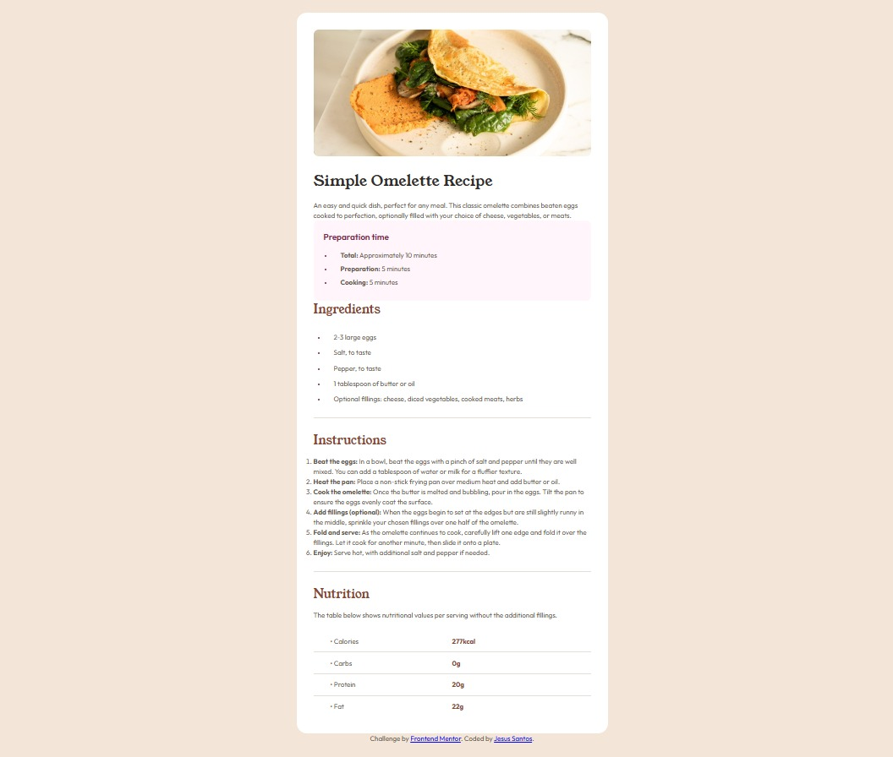

# Frontend Mentor - Recipe page solution

This is a solution to the [Recipe page challenge on Frontend Mentor](https://www.frontendmentor.io/challenges/recipe-page-KiTsR8QQKm). Frontend Mentor challenges help you improve your coding skills by building realistic projects. 

## Table of contents

- [Overview](#overview)
  - [The challenge](#the-challenge)
  - [Screenshot](#screenshot)
  - [Links](#links)
- [My process](#my-process)
  - [Built with](#built-with)
  - [What I learned](#what-i-learned)
  - [Continued development](#continued-development)
- [Author](#author)

## Overview

### The challenge

Users should be able to:

- View an optimal layout depending on their device's screen size.
- See hover and focus states for interactive elements.

### Screenshot



### Links

- Solution URL: [GitHub Repository](https://github.com/jesussantos210/recipe-page-jesus))
- Live Site URL: [Live Site](https://tu-usuario.github.io/tu-repositorio)

## My process

### Built with

- Semantic HTML5 markup
- CSS custom properties (Variables)
- CSS Grid
- Flexbox
- Mobile-first workflow

### What I learned

In this project, I learned how to style specific list markers using the `::marker` pseudo-element to change their color independently from the text. I also practiced using CSS Grid to create a perfectly aligned nutrition table.

Here are some code snippets I'm proud of:

```css
/* Styling list markers separately */
.ingredients-list li::marker {
    color: var(--brown-800);
    font-weight: 700;
}

/* Using Grid for the nutrition table alignment */
.nutrition-item {
    display: grid;
    grid-template-columns: 1fr 1fr;
    border-bottom: 1px solid var(--stone-150);
} 
```
### Continued development

In future projects, I want to continue focusing on writing cleaner, more reusable CSS classes and deepening my understanding of responsive design patterns for complex layouts.

### Author
Github - [JesusSantos210](https://github.com/jesussantos210)

Frontend Mentor - [Jesussantos210](https://www.frontendmentor.io/profile/jesussantos210)
